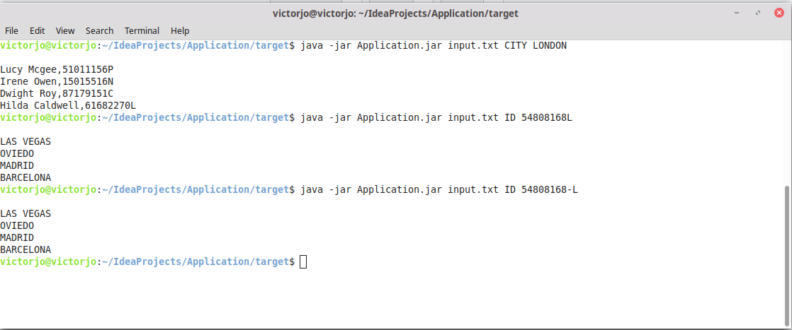

# JAVA TECHNICAL TEST

This is a simple file processing program.   
The data is structured to a particular format.


## USAGE

The two supported command are as follows    
`java -jar application.jar {FILE} CITY {CITY_NAME}`    
`java -jar application.jar {FILE} ID {ID_VALUE}`

```bash
java -jar application.jar input.txt CITY BARCELONA
```
The above must output an unordered unrepeated list of people and IDs that have been to LONDON.

```bash
java -jar application.jar input.txt ID 54808168L
```
The above must output an unordered unrepeated list of cities that Shelley Payne have been to.



In advent of a command like this:

```bash
java -jar application.jar input.txt ID 54808168-L
```
The program has been designed to handle the F2 ID format.

The program has been made to abstract most of its complexities.

This executes the program

```java
 String input = args[0];
 String parameter_1 = args[1];
 String parameter_2 = args[2];

 DataFileProcessor.setProcessingParameters(input, parameter_1, parameter_2)
                    .processDataFile()
                    .getOutputData();
```

## OTHER

The program stores data based on the parameter given, if parameter one is CITY only
individuals who have been to this city will be stored. The same goes if parameter one is ID

The Application.jar file can be found in the

```bash
java -jar /Application/out/artifacts/Application_jar/Application.jar
```
A 3.3GB file was used to test this program which completed execution at ~ 24s.

## AUTHOR
JO-AMADI VICTOR N.  
victorjo603@gmail.com