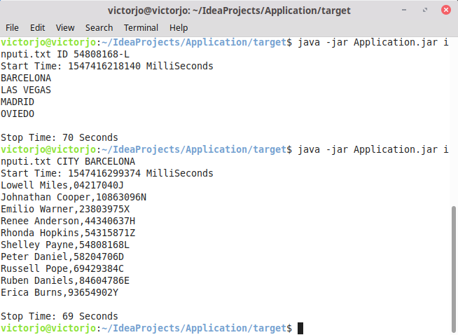
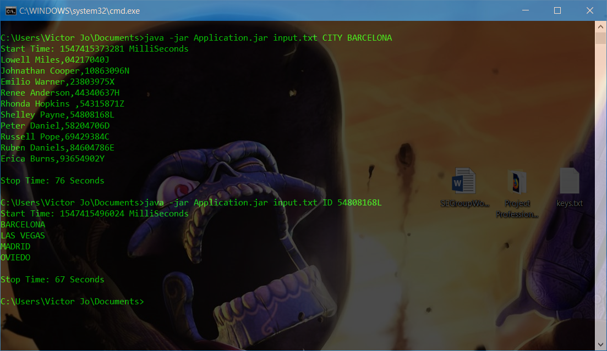

# JAVA FILE PROCESSOR

This is a simple file processing program.   
The data is structured to a particular format, shown below;    

```
F1
D Erica Burns,BARCELONA,93654902Y
D Lucy Mcgee,LONDON,51011156P  
D Mitchell Newton,SAN FRANCISCO,25384390A  
D Margarita Richards,LAS VEGAS,09877359D   
D Rhonda Hopkins,SAN FRANCISCO,54315871Z   
D Antonia Harper,LAS VEGAS,27466628M   
D Hilda Caldwell,LONDON,61682270L  
D Alexander Arnold,SAN FRANCISCO,21743514G 
D Cheryl Hawkins,LAS VEGAS,76878166E   
D Renee Anderson,BARCELONA,44340637H   
F2 
D Mitchell Newton ; LAS VEGAS ; 25384390-A 
D Margarita Richards ; NEW YORK ; 09877359-D   
D Rhonda Hopkins ; BARCELONA ; 54315871-Z  
D Taylor Matthews ; LISBOA ; 58202263-G    
D Shelley Payne ; MADRID ; 54808168-L  
D Johnathan Cooper ; PARIS ; 10863096-N    
F1 
D Lowell Miles,BARCELONA,04217040J 
D Russell Pope,BARCELONA,69429384C 
D Shelley Payne,BARCELONA,54808168L    
D Johnathan Cooper,BARCELONA,10863096N 
D Myra Maldonado,LAS VEGAS,32445934H   
D Irene Owen,LONDON,15015516N  
D Susan Holland,SAN FRANCISCO,04810023X    
D Rodolfo West,LAS VEGAS,74176315G 
D Peter Daniel,BARCELONA,58204706D 
F2 
D Russell Pope ; CARTAGENA ; 69429384-C    
D Shelley Payne ; OVIEDO ; 54808168-L  
D Johnathan Cooper ; SANTANDER ; 10863096-N    
D Myra Maldonado ; MARSELLA ; 32445934-H   
D Glenn Bryan ; LISBON ; 90844421-X    
D Neal Love ; SEVILLA ; 52498689-Q   
D Taylor Matthews ; LONDRES ; 58202263-G   
F1 
D Marta Mendez,LAS VEGAS,17200667W 
D Glenn Bryan,LAS VEGAS,90844421X  
D Neal Love,LAS VEGAS,52498689Q    
D Taylor Matthews,LAS VEGAS,58202263G  
D Tommie Lindsey,LAS VEGAS,12020245P   
D Shelley Payne,LAS VEGAS,54808168L    
D Ruben Daniels,BARCELONA,84604786E    
D Emilio Warner,BARCELONA,23803975X    
D Mark Quinn,LAS VEGAS,82098573G   
D Dwight Roy,LONDON,87179151C  
D Jake Salazar,SAN FRANCISCO,38399984N 
D Edna Soto,LAS VEGAS,66991455E`
```   

## USAGE

The two supported command are as follows    
`java -jar application.jar {FILE} CITY {CITY_NAME}`    
`java -jar application.jar {FILE} ID {ID_VALUE}`

```bash
java -jar application.jar input.txt CITY BARCELONA
```
The above must output an unordered unrepeated list of people and IDs that have been to BARCELONA.

```bash
java -jar application.jar input.txt ID 54808168L
```
The above must output an unordered unrepeated list of cities that Shelley Payne have been to.
 
The input data as shown above was duplicated (as it is) to be a **_6.7GB_** large file.   
The **_6.7GB_** file was used to test this program, which completed execution at ~ **70s** (at extreme situations ~ **_90s_**).  
 
_Execution time on Linux:  
Linux Mint 19 x64    
Intel© Core™ i5-7200U CPU @ 2.50GHz × 2     
8gb ram (DDR4)  
500GB hdd_   
  
  
  
_Execution time on Windows:  
Windows 10 x64  
Intel© Core™ i5-7200U CPU @ 2.50GHz × 2  
8gb ram (DDR4)  
500GB_   


    
Processing time may differ for different systems and other currently running processes.

In advent of a command like this:

```bash
java -jar application.jar input.txt ID 54808168-L
```
The program has been designed to handle the F2 ID format.

The program has been made to abstract most of its complexities.

This executes the program

```java
 String input = args[0];
 String parameter_1 = args[1];
 String parameter_2 = args[2];

 com.application.DataFileProcessor.setProcessingParameters(input, parameter_1, parameter_2)
                    .processDataFile()
                    .getOutputData();
```

## OTHER

The program stores data based on the parameter given, if parameter one is CITY only
individuals who have been to this city will be stored. The same goes if parameter one is ID

The com.application.Application.jar file can be found in the

```bash
java -jar /com.application.Application/out/artifacts/Application_jar/com.application.Application.jar
```

## AUTHOR
JO-AMADI VICTOR N.  
victorjo603@gmail.com